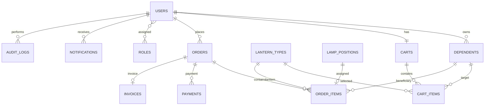

# 🏮 Online Lighting System｜線上點燈管理系統

> **Database Systems Final Project｜資料庫系統期末專題**  
> Feng Chia University｜逢甲大學

A database-oriented web application that digitalizes the complete workflow of temple lantern-lighting services, including member management, prayer profiles, lantern selection, orders, payments, physical lamp allocation, notifications, and administrative operations.

以**資料庫系統設計**為核心的線上點燈 Web 應用程式，將傳統寺廟點燈流程數位化，涵蓋會員管理、祈福對象、燈種選擇、購物車、訂單、付款、實體燈位配置、通知系統與後台管理。

---

## 📌 Project Overview｜專案簡介

**Online Lighting System** is a full-stack database course project designed to simulate a realistic temple lantern-lighting information system.

The project focuses on relational database modeling and integrates front-end pages, PHP business logic, MySQL data storage, authentication, order processing, administrative management, and scheduled notification workflows.

**Online Lighting System 線上點燈管理系統**是一套模擬真實寺廟點燈流程的資料庫應用系統。

專案以關聯式資料庫為核心，整合會員前台、PHP 後端邏輯、MySQL 資料庫、身分驗證、點燈訂單、實體燈位、通知與管理後台，實作從會員建立資料直到管理員完成點燈配置的完整流程。

### Main Goals｜專案目標

- Build a realistic relational database application.  
  建立具備實際應用情境的關聯式資料庫系統。
- Model relationships between users, orders, lanterns, prayer targets, and physical lamp positions.  
  建模會員、訂單、燈種、祈福對象與實體燈位之間的關聯。
- Apply database constraints, indexes, foreign keys, and role-based authorization.  
  實作 Constraint、Index、Foreign Key 與角色權限控制。
- Implement both member-facing and administrator-facing workflows.  
  建立會員端與管理員端完整操作流程。
- Demonstrate how database concepts support a complete information system.  
  將資料庫課程概念實際應用於完整資訊系統。

---

## ✨ Core Features｜核心功能

### 👤 Member System｜會員系統

- Member registration and login｜會員註冊與登入
- Personal profile management｜個人資料管理
- Password reset workflow｜密碼重設流程
- Phone verification / phone login flow｜手機驗證與手機登入流程
- Third-party identity / OAuth integration architecture｜第三方帳號與 OAuth 整合架構
- Prayer target / dependent management｜眷屬與祈福對象管理
- Notification preference management｜通知偏好設定

### 🏮 Lantern Services｜點燈服務

- Browse available lantern types｜瀏覽各類燈種
- View lantern descriptions and prices｜查看燈種說明與價格
- Select prayer targets before choosing lanterns｜選擇祈福對象後進行點燈
- Annual-rule-based lantern recommendations｜根據年度流年規則提供燈種建議
- Visual lamp wall｜視覺化燈牆
- Physical lamp-position tracking｜實體燈位追蹤與管理
- Renewal recommendation workflow｜點燈續約推薦流程

### 🛒 Shopping & Order System｜購物車與訂單系統

- Shopping cart｜購物車
- Multiple lantern items per order｜一筆訂單可包含多個點燈項目
- Prayer target associated with each order item｜每個訂單項目可對應不同祈福對象
- Order status tracking｜訂單狀態追蹤
- Payment records｜金流紀錄
- Invoice / receipt records｜電子發票／收據紀錄
- Service-period expiration management｜點燈年度與到期日管理

### 🔔 Notification System｜通知系統

The database architecture supports multiple notification channels:

資料庫架構支援多種通知管道：

- Email
- SMS
- LINE
- System notification｜站內通知

The system also records delivery status, provider responses, retries, and failure / skipped reasons.

系統同時記錄投遞狀態、服務商回應、重試狀態，以及失敗或略過原因。

### 🛠 Administrator System｜管理員後台

- Admin authentication｜管理員登入
- Role-Based Access Control (RBAC)｜角色權限控制
- Member management｜會員管理
- Admin account management｜管理員帳號管理
- Lantern type management｜燈種管理
- Physical lamp-position management｜實體燈位管理
- Lamp-wall editor｜燈牆編輯器
- Order review and processing｜訂單審核與處理
- Payment confirmation｜付款確認
- Lamp-position assignment｜燈位配置
- Annual service-period management｜年度點燈期間管理
- Annual flow-rule management｜流年推薦規則管理
- Article / announcement management｜公告與文章管理
- Notification management｜通知管理
- Scheduled job management｜排程任務管理
- Feedback management｜使用者回饋管理
- Audit log inspection｜操作紀錄查詢
- Statistics and reporting｜統計與報表

---

## 🔄 System Workflow｜系統流程

```mermaid
flowchart LR
    A[Register / Login<br/>註冊 / 登入]
    B[Profile<br/>會員資料]
    C[Prayer Target<br/>祈福對象]
    D[Recommendation<br/>燈種推薦]
    E[Shopping Cart<br/>購物車]
    F[Order<br/>訂單]
    G[Payment<br/>付款]
    H[Admin Review<br/>管理員審核]
    I[Lamp Assignment<br/>燈位配置]
    J[Invoice<br/>發票 / 收據]
    K[Notification<br/>通知]
    L[Order & Lamp Status<br/>訂單 / 燈位查詢]

    A --> B
    B --> C
    C --> D
    D --> E
    E --> F
    F --> G
    G --> H
    H --> I
    I --> J
    J --> K
    K --> L
```



### Main Workflow｜主要流程

1. User registers or logs in.｜使用者註冊或登入系統。
2. User maintains personal information and prayer targets.｜建立個人資料與祈福對象。
3. The system derives profile information used by recommendation rules.｜系統依個人資料產生推薦所需資訊。
4. User selects a prayer target and browses lantern types.｜使用者選擇祈福對象並瀏覽燈種。
5. Annual rules provide recommended lantern types.｜年度流年規則產生推薦燈種。
6. Selected lanterns are added to the shopping cart.｜將燈種加入購物車。
7. Checkout creates order, order-item, and payment records.｜結帳後建立訂單、訂單明細與付款紀錄。
8. Administrator reviews the order.｜管理員審核訂單。
9. Available physical lamp positions are assigned.｜系統配置可使用的實體燈位。
10. Invoice and notification records are generated.｜建立發票／收據與通知紀錄。
11. User can check order and lantern status.｜使用者可查詢訂單與點燈狀態。

---

## 🗄️ Database Design｜資料庫設計

This project uses a **relational database architecture** with foreign-key constraints and indexed query paths.

本專案採用**關聯式資料庫架構**，透過 Foreign Key、Constraint 與 Index 維持資料一致性並改善查詢效率。

### Database Domains｜資料表分類

| Domain / 類別 | Main Tables / 主要資料表 |
|---|---|
| Account & Authentication 帳號與驗證 | `users`, `roles`, `user_roles`, `auth_identities`, `oauth_states`, `phone_login_codes`, `password_resets` |
| Prayer Profile 祈福資料 | `dependents` |
| Lantern Management 燈種管理 | `lantern_types`, `lamp_positions`, `lamp_service_periods` |
| Annual Recommendation 年度推薦 | `annual_flow_rules`, `annual_flow_entries` |
| Shopping Cart 購物車 | `carts`, `cart_items` |
| Order System 訂單系統 | `orders`, `order_items` |
| Payment 金流 | `payments` |
| Invoice 發票 | `invoices` |
| Notification 通知 | `notifications`, `user_notification_preferences`, `notification_deliveries` |
| Content Management 內容管理 | `articles` |
| Feedback 使用者回饋 | `feedbacks` |
| Background Jobs 排程工作 | `scheduled_jobs` |
| Audit 操作紀錄 | `audit_logs` |
| Statistics 統計資料 | `statistics` |

Complete schema｜完整 Schema：

[`sql/schema.sql`](sql/schema.sql)

Seed data｜初始測試資料：

[`sql/seed.sql`](sql/seed.sql)

---

## 🔗 Simplified ER Relationship｜簡化資料關聯



---

## 🧠 Database Concepts Applied｜資料庫概念應用

### Relational Data Modeling｜關聯式資料建模

The system separates users, orders, order items, lantern types, physical positions, payments, and notifications into independent entities.

系統將會員、訂單、訂單明細、燈種、實體燈位、金流與通知拆分為不同 Entity。

### Primary & Foreign Keys｜主鍵與外鍵

Foreign-key relationships preserve referential integrity between tables.

透過 Foreign Key 維持資料表之間的參照完整性。

### One-to-Many Relationships｜一對多關係

Examples｜例如：

- User → Orders｜一位會員 → 多筆訂單
- User → Dependents｜一位會員 → 多位祈福對象
- Order → Order Items｜一筆訂單 → 多筆訂單明細
- Lantern Type → Lamp Positions｜一種燈種 → 多個實體燈位

### Many-to-Many Relationships｜多對多關係

User roles are represented through an intermediate mapping table:

會員與角色透過中介表建立多對多關係：

`users ↔ user_roles ↔ roles`

### Referential Integrity｜參照完整性

Foreign-key constraints define behaviors such as:

- `CASCADE`
- `RESTRICT`
- `SET NULL`

透過這些 Constraint 確保資料刪除或更新時仍維持資料一致性。

### Indexing｜索引

Indexes are used on commonly queried fields such as:

- User ID
- Email
- Phone
- Order status
- Lamp status
- Service year
- Notification status

### Audit Logging｜操作紀錄

Important system and administrator operations can be recorded in `audit_logs`.

重要的系統與管理員操作可記錄於 `audit_logs`，讓後台操作具備可追蹤性。

---

## 🧰 Tech Stack｜技術棧

| Layer / 層級 | Technology / 技術 |
|---|---|
| Backend 後端 | PHP |
| Database 資料庫 | MySQL / MariaDB-compatible SQL |
| Frontend 前端 | HTML / CSS / JavaScript |
| Web Server | Apache |
| Authentication 身分驗證 | PHP Session / OAuth architecture / Phone verification |
| Database Access | PHP + SQL |
| Version Control | Git / GitHub |

---

## 📂 Project Structure｜專案結構

```text
online-lighting/
│
├── admin/        # Administrator pages / 管理員後台
├── api/          # API and session endpoints / API 與 Session 端點
├── assets/       # CSS, JavaScript, images
├── config/       # Database and integration configuration / 資料庫與第三方服務設定
├── docs/         # Architecture and deployment docs / 系統架構與部署文件
├── public/       # Member-facing pages / 使用者前台
├── sql/          # Schema, seed data, migrations
├── storage/      # Runtime storage
├── tasks/        # Background and scheduled jobs / 排程與背景工作
├── index.php
├── DEPLOY.md
└── README.md
```

---

## 🚀 Installation｜安裝方式

### Requirements｜環境需求

- Apache
- PHP
- MySQL or MariaDB
- Web Browser

### 1. Clone Repository｜Clone 專案

```bash
git clone https://github.com/Ayak444/online-lighting.git
cd online-lighting
```

### 2. Create Database｜建立資料庫

Import the SQL files in the following order:

依照以下順序匯入 SQL：

```text
1. sql/schema.sql
2. sql/seed.sql
```

### 3. Database Configuration｜資料庫設定

Create｜建立：

```text
config/db.local.php
```

Example｜範例：

```php
<?php
declare(strict_types=1);

return [
    'host' => 'localhost',
    'port' => '3306',
    'name' => 'YOUR_DATABASE_NAME',
    'user' => 'YOUR_DATABASE_USER',
    'pass' => 'YOUR_DATABASE_PASSWORD',
];
```

> ⚠️ Never commit production passwords, OAuth secrets, or API keys to GitHub.  
> ⚠️ 請勿將正式環境的資料庫密碼、OAuth Secret 或 API Key 上傳至 GitHub。

### 4. Optional Integration Configuration｜第三方服務設定

OAuth and other external integrations should use local configuration files under `config/`.

OAuth 與其他第三方整合設定應放在 `config/` 中，敏感憑證請保持在 Git 版本控制之外。

### 5. Apache Deployment｜Apache 部署

Place the project under the Apache web root.

將專案放置於 Apache Web Root 下即可執行。

More information｜更多部署資訊：

[`DEPLOY.md`](DEPLOY.md)

---

## 📚 Documentation｜專案文件

### Architecture Map｜系統架構

[`docs/architecture-map.md`](docs/architecture-map.md)

Includes:

- ER entities
- Database table mapping
- Member workflows
- Administrative workflows
- Notification architecture
- Order and lamp allocation flow

### Deployment Guide｜部署說明

[`DEPLOY.md`](DEPLOY.md)

Includes:

- Apache deployment
- Database initialization
- Configuration
- Smoke tests

---

## 🎓 Academic Context｜課程背景

This project was developed as a **Database Systems Final Project** at **Feng Chia University**.

本專案為**逢甲大學資料庫系統課程期末專題**。

The primary objective was not only to build a web interface, but to design a complete information system around a relational database.

本專題的重點不只是製作網站，而是以資料庫為核心設計一套完整資訊系統。

Topics demonstrated include:

- ER modeling｜ER 資料建模
- Relational schema design｜關聯式 Schema 設計
- Primary / Foreign Keys｜主鍵與外鍵
- Referential integrity｜參照完整性
- Database normalization concepts｜資料庫正規化概念
- Index design｜索引設計
- Authentication data｜身分驗證資料
- RBAC｜角色權限管理
- Transaction-oriented order data｜交易與訂單資料
- Audit logging｜操作紀錄
- Administrative reporting｜後台報表
- Seed data｜初始資料
- Schema migrations｜資料庫 Migration

---

## 👥 Contributors & Attribution｜團隊與來源

This repository represents a **team course project** rather than an individual-only project.

本 Repository 為**團隊課程專題**，並非個人獨立完成之專案。

### Repository

Current fork｜目前 Fork：

[**Ayak444/online-lighting**](https://github.com/Ayak444/online-lighting)

Original repository｜原始 Repository：

[**Dennis10181024/online-lighting**](https://github.com/Dennis10181024/online-lighting)

### Known Project Members / Repository Owners

- [Ayak444](https://github.com/Ayak444) — Team member / Fork owner
- [Dennis10181024](https://github.com/Dennis10181024) — Original repository owner

The original Git history is preserved so that development history and authorship remain traceable.

此 Fork 保留原始 Git Commit 紀錄，使專案開發歷程與原作者資訊可被追溯。

---

## 🔐 Security Notes｜安全注意事項

Do **not** commit the following information:

請勿將以下資訊提交至 GitHub：

- Database passwords｜資料庫密碼
- OAuth Client Secrets
- API keys
- SMS provider credentials
- Email service credentials
- Production environment secrets

Local configuration files or environment variables should be used for sensitive settings.

敏感資訊應透過 Local Configuration 或環境變數管理。

---

## 📖 Purpose｜用途

This repository is maintained for:

- Academic demonstration｜課程成果展示
- Database Systems learning｜資料庫系統學習
- Software portfolio｜軟體作品集
- System architecture reference｜系統架構參考

---

## 🏮 Online Lighting System

**Database Systems Final Project · Feng Chia University**

A complete database-driven temple lantern-lighting information system.

以資料庫為核心所建構的完整線上點燈資訊系統。
